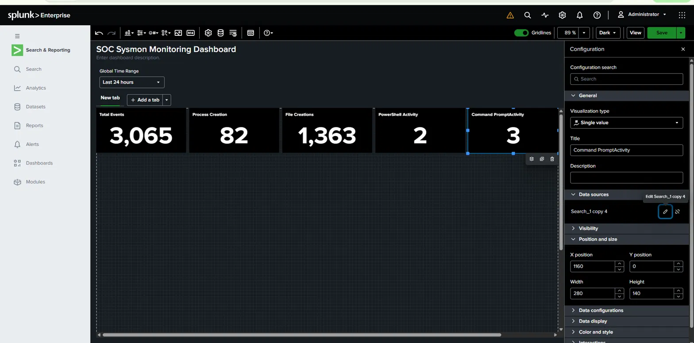
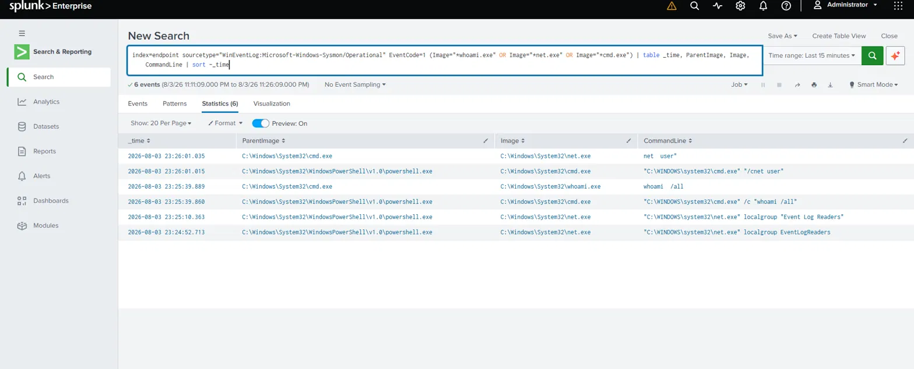
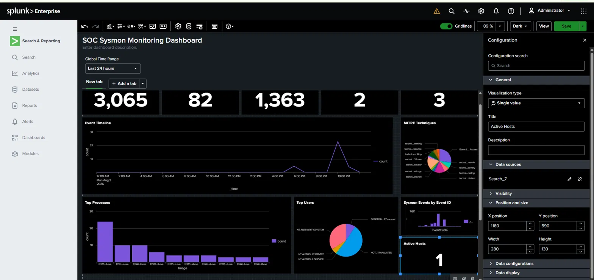
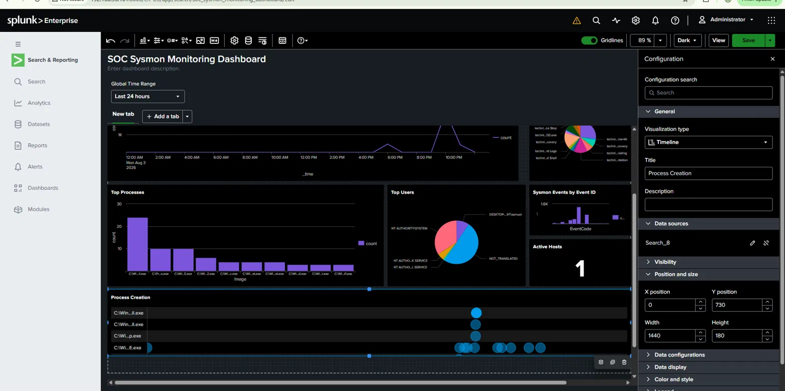
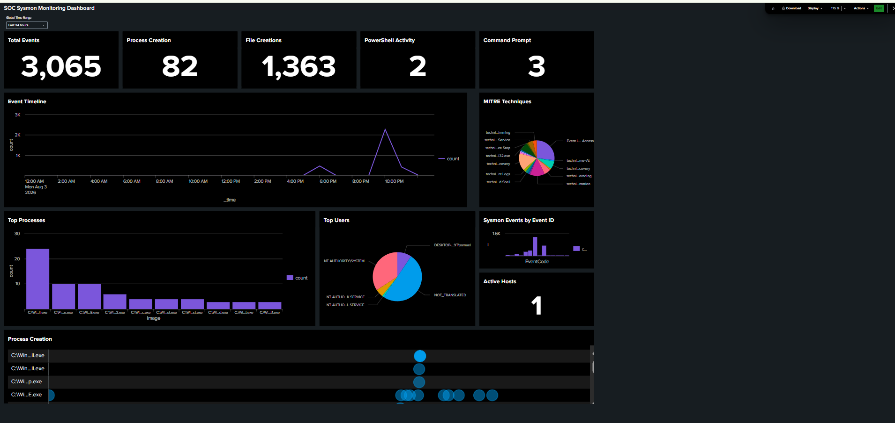

# Windows SOC Monitoring Home Lab (Splunk + Sysmon)

A self-built Security Operations Center lab simulating real-world endpoint monitoring, log ingestion, and threat detection using Splunk Enterprise and Sysmon on a Windows endpoint.

  

---

## Overview

This project simulates a small enterprise SOC environment to practice log collection, detection engineering, and dashboarding — the core day-to-day workflow of a SOC analyst. It was built entirely from scratch in a home lab using VirtualBox, with no pre-built lab kits or automation scripts, in order to encounter (and fix) the same configuration issues a junior analyst or engineer would face in a real deployment.

**Goals:**
- Stand up a functioning log pipeline from a Windows endpoint to a central Splunk indexer
- Build detection logic around common adversary reconnaissance behavior (`whoami`, `net user`, process trees)
- Visualize endpoint activity and detections through custom dashboards
- Practice real troubleshooting: permissions issues, forwarder configuration, dashboard tooling quirks

---

## Architecture

```
┌─────────────────────────┐         ┌──────────────────────────┐
│     Windows-Target       │  9997   │      Splunk Server        │
│   (VirtualBox VM)        │ ──────► │   (Linux, VirtualBox VM)  │
│                           │  TCP    │                            │
│  • Sysmon                │         │  • Splunk Enterprise      │
│  • Splunk Universal      │         │  • index=endpoint         │
│    Forwarder             │         │  • Splunk Add-on for      │
│  • Monitors: Security,   │         │    Sysmon                 │
│    System, Application,  │         │  • Splunk Security         │
│    Sysmon/Operational    │         │    Essentials             │
└─────────────────────────┘         └──────────────────────────┘
                                              │
                                              ▼
                                    Web UI (192.168.56.101:8000)
                                    Custom dashboards + detections
```

---

## Environment

| Component | Details |
|---|---|
| Hypervisor | VirtualBox |
| Endpoint VM | Windows-Target (Windows 10/11) |
| Indexer VM | Splunk Server (Linux, Splunk Enterprise) |
| Indexer IP | `192.168.56.101` |
| Ingestion port | `9997` (Splunk-to-Splunk forwarding) |
| Custom index | `endpoint` (dedicated, not `main`) |
| Log sources | Windows Security, System, Application event logs + Sysmon Operational |
| Splunk apps installed | Splunk Add-on for Sysmon, Splunk Security Essentials |

---

## What Was Built

### 1. Log Pipeline
- Installed and configured Splunk Universal Forwarder on the Windows endpoint
- Configured a dedicated `endpoint` index rather than dumping data into `main`, to keep the environment clean and query-able at scale
- Verified forwarder-to-indexer connectivity (`Active` state on port 9997)

### 2. Sysmon Integration
- Deployed Sysmon and configured `inputs.conf` to monitor the Sysmon Operational log channel
- **Resolved an `errorCode=5` (Access Denied) issue** preventing the forwarder from subscribing to the Sysmon Operational event log channel — fixed by adding `NT SERVICE\SplunkForwarder` to the local **Event Log Readers** group
- This same error recurred later after a forwarder restart, requiring a second round of diagnosis and a clean service restart to resolve — a good reminder that Windows service/permission state isn't always durable across restarts

### 3. Detection Logic
Built a working detection for basic reconnaissance activity, hunting for process trees consistent with an attacker (or red-team operator) enumerating the host:

```spl
index=endpoint sourcetype="WinEventLog:Microsoft-Windows-Sysmon/Operational" EventCode=1
(Image="*whoami.exe" OR Image="*net.exe" OR Image="*cmd.exe")
| table _time, ParentImage, Image, CommandLine
| sort -_time
```

Validated end-to-end by executing recon commands on the endpoint (`whoami /all`, `net user`, `net localgroup administrators`) and confirming full process-tree visibility:

```
powershell.exe → cmd.exe → whoami.exe / net.exe
```

### 4. Dashboards

**Classic Dashboard — "Windows SOC Monitoring"**
A lightweight 4-panel operational view:
- Total Events (single value)
- Process Creation Events (single value)
- Top Processes Spawned (bar chart)
- Recent Recon Activity — live table of whoami/net/cmd execution with full parent/child context

**Dashboard Studio — "SOC Sysmon Monitoring Dashboard"**
A more advanced, analyst-facing view built in Splunk's newer Dashboard Studio, including:
- 5 KPI panels (Total Events, Process Creation, File Creations, PowerShell Activity, Command Prompt)
- Event Timeline (hourly event volume, line chart)
- MITRE ATT&CK technique breakdown (pie chart, driven off Sysmon's built-in `RuleName` technique tagging)
- Top Processes Spawned (column chart)
- Top Users (pie chart)
- Sysmon Events by Event ID (column chart)
- Active Hosts (single value, host cardinality)
- Process Creation swimlane (Timeline visualization — per-process execution over time)

---

## Notable Troubleshooting

Documenting real problems solved, not just the happy path:

| Issue | Root Cause | Fix |
|---|---|---|
| Sysmon events missing from Splunk | Forwarder service account lacked read access to the Sysmon Operational log channel (`errorCode=5`) | Added `NT SERVICE\SplunkForwarder` to local **Event Log Readers** group |
| Same `errorCode=5` recurred later | Forwarder service state didn't persist the fix cleanly across a restart | Force-stopped and restarted the `SplunkForwarder` service via elevated PowerShell |
| Dashboard Studio panel resize failing | Canvas was in **Grid** layout, which enforces gapless row/column rectangles and doesn't support free corner-dragging | Switched canvas layout to **Absolute**, enabling pixel-precise `X/Y/Width/Height` control |
| Chart panels rendering "No search results returned" despite valid SPL | Panel's **Time range** was set to `Default`, which binds to a `$global_time.earliest$/$global_time.latest$` token — this token wasn't resolving correctly for certain panel types | Changed panel time range from `Default` to `Static` → explicit `Last 24 hours`, bypassing the token binding entirely |
| Recon events not appearing in dashboard table | Panel visualization type had been switched from Statistics Table to a scatter/bubble Chart type, which can't render tabular fields | Reset visualization type back to **Statistics Table** |

---

## Skills Demonstrated

- Splunk Enterprise administration (indexes, forwarders, sourcetypes)
- Windows event log and Sysmon telemetry configuration
- SPL query writing (`stats`, `timechart`, `table`, field filtering, sorting)
- Basic detection engineering aligned to adversary recon behavior (MITRE ATT&CK-adjacent)
- Dashboard design in both Splunk Classic Dashboards and Dashboard Studio
- Windows service and Active Directory-local permission troubleshooting (Event Log Readers, service accounts)
- Methodical, isolate-and-verify debugging approach (validating each layer — forwarder → index → search → visualization — independently rather than guessing)

---

## Roadmap

- [ ] Replace default Sysmon config with a hardened, detection-oriented ruleset (SwiftOnSecurity or Olaf Hartong's `sysmon-modular`) to unlock network connection, registry, and image-load telemetry
- [ ] Deploy real MITRE ATT&CK-mapped detections from Splunk Security Essentials
- [ ] Add a "Detections Fired" panel driven by saved searches / correlation searches rather than raw event matching
- [ ] Simulate additional adversary techniques (credential access, persistence, lateral movement) in a controlled way and validate detection coverage
- [ ] Export and version-control dashboard source (`.xml` / Studio JSON) in this repo

---


## Screenshots

### Classic Dashboard


### Recon Detection — Process Tree


### Dashboard Studio — Full Overview


### Process Creation Timeline


### Final Dashboard Overview

---

## Notes

This lab is intentionally built and documented manually, without automation scripts, to reinforce hands-on familiarity with Splunk's configuration surface, Windows event log internals, and the practical debugging skills required to run a SOC pipeline end-to-end.
